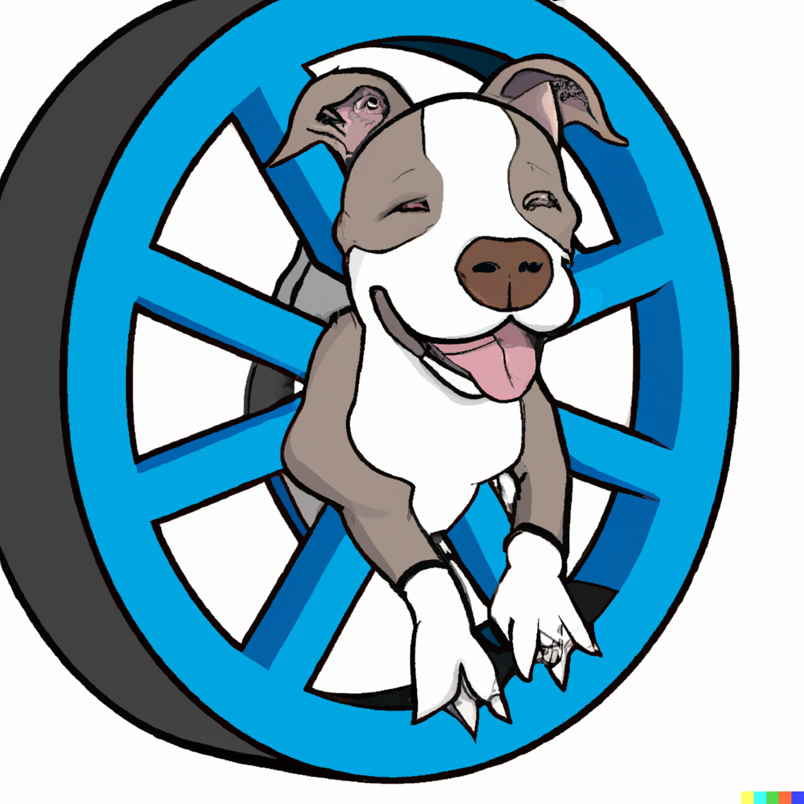
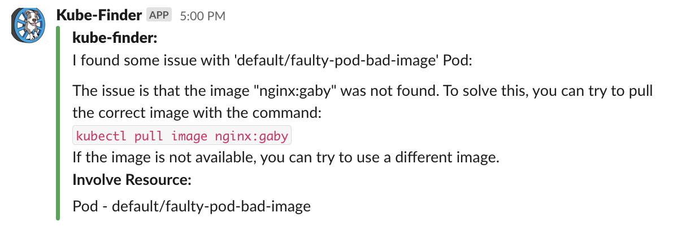
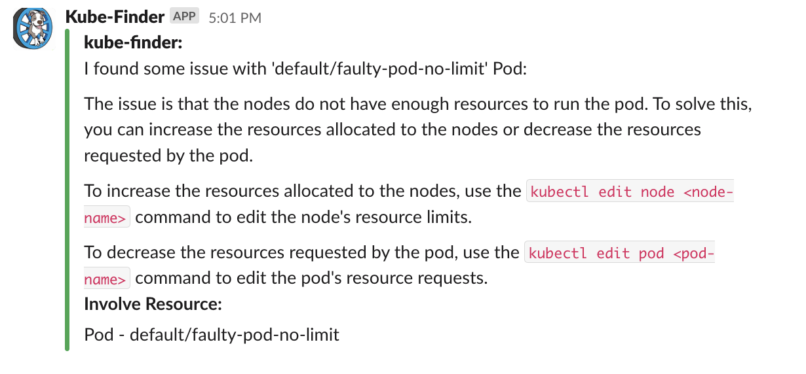
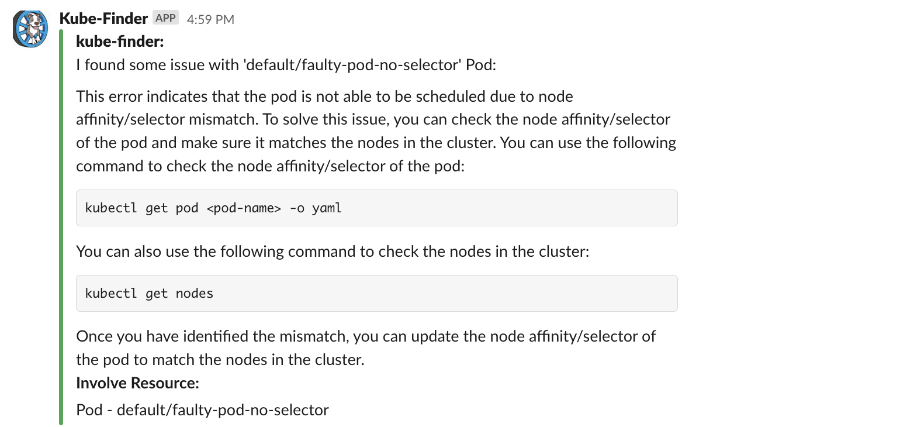

<!-- PROJECT SHIELDS -->
<!--
*** I'm using markdown "reference style" links for readability.
*** Reference links are enclosed in brackets [ ] instead of parentheses ( ).
*** See the bottom of this document for the declaration of the reference variables
*** for contributors-url, forks-url, etc. This is an optional, concise syntax you may use.
*** https://www.markdownguide.org/basic-syntax/#reference-style-links
-->

   [![Contributors][contributors-shield]][contributors-url]
   [![Forks][forks-shield]][forks-url]
   [![Stargazers][stars-shield]][stars-url]
   [![Issues][issues-shield]][issues-url]
   [![LinkedIn][linkedin-shield]][linkedin-url]


<!-- PROJECT LOGO -->
<br />
  <h3 align="center">Kube-Finder Operator
</h3>

<p align="center">
    
  <p align="center">
    Intelligent Kubernetes Cluster Issue Resolution
    <br />
    <a href="https://github.com/tikalk/kube-finder"><strong>Explore the docs »</strong></a>
    <br />
    <br />
    <a href="https://github.com/tikalk/kube-finder/issues">Report Bug</a>
    ·
    <a href="https://github.com/tikalk/kube-finder/issues">Request Feature</a>
  </p>
</p>


<!-- TABLE OF CONTENTS -->
<details open="open">
  <summary>Table of Contents</summary>
  <ol>
    <li>
      <a href="#about-the-project">About The Project</a>
    </li>
    <li>
      <a href="#getting-started">Getting Started</a>
      <ul>
        <li><a href="#prerequisites">Prerequisites</a></li>
        <li><a href="#installation">Installation</a></li>
      </ul>
    </li>
    <li><a href="#usage">Usage</a></li>
    <li><a href="#roadmap">Roadmap</a></li>
    <li><a href="#contributing">Contributing</a></li>
    <li><a href="#contact">Contact</a></li>
    <li><a href="#acknowledgements">Acknowledgements</a></li>
  </ol>
</details>


<!-- ABOUT THE PROJECT -->
## About The Project

The Kube-Finder Operator is an AI-powered tool that quickly detects and helps resolve issues within your Kubernetes clusters. By combining AI technology with the Kubernetes control loop, it automatically scans your clusters for misconfigurations and provides simple step-by-step instructions to fix them.

Key Features:
1. AI-driven Scanning: Advanced algorithms scan your clusters, eliminating the need for manual inspection.
2. Swift Issue Detection: Quickly identifies misconfigurations and root causes.
3. Step-by-Step Guidance: Provides clear instructions for efficient issue resolution.
4. Seamless Integration: Easily integrates into your existing Kubernetes environment.

Benefits:
- Increased Efficiency: Saves time and effort by streamlining issue resolution.
- Enhanced Cluster Security: Proactively identifies security vulnerabilities.
- Simplified Issue Resolution: Makes complex problems easy to solve.
- Real-time Monitoring: Monitors cluster health and provides timely alerts.

The Kube-Finder Operator optimizes cluster health and stability, saving time and resources while ensuring infrastructure security.


<!-- GETTING STARTED -->
## Getting Started

### Prerequisites

* OpenAI Token Secret
* Slack Token Secret

### Installation

1. Add the Helm repo
   ```bash
    helm repo add kube-finder https://tikalk.github.io/kube-finder   
    helm repo update
   ```
2. Install the KubeFinder chart
   ```bash
   helm install kube-finder Charts/kube-finder \ 
   --create-namespace -n kube-finder
   ```
3. Apply the Finder manifest on your Kubernetes cluster:
    ```yaml
    apiVersion: kubefinder.tikalk.com/v1alpha1
    kind: Finder
    metadata:
      name: finder-sample
    spec:
        find:
        - "pods"
        notify:
            slack:
              channelID: "XXXXXXXXX"
    ```

<!-- USAGE EXAMPLES -->
##  Usage

There are many examples for manifests with misconfigurations under the path `config/samples`, you can use them for getting started.

To trigger the KubeFinder, you have to apply a wrong Kubernetes manifest.
```bash
kubectl apply -f <manifest.yaml>
```

While this manifest applied, the KubeFinder will be trigger on the Slack channel and show you the instructions to resolve youe issues:
<p align="center">

<p align="center">

<p align="center">



---

<!-- ROADMAP -->
## Roadmap

See the [open issues](https://github.com/tikalk/kube-finder/issues) for a list of proposed features (and known issues).


<!-- CONTRIBUTING -->
## Contributing

Contributions are what make the open source community such an amazing place to be learn, inspire, and create. Any contributions you make are **greatly appreciated**.

1. Fork the Project
2. Create your Feature Branch (`git checkout -b feature/AmazingFeature`)
3. Commit your Changes (`git commit -m 'Add some AmazingFeature'`)
4. Push to the Branch (`git push origin feature/AmazingFeature`)
5. Open a Pull Request


<!-- Creators -->
## Creators

[Gaby Tal](https://github.com/gabytal), [Amir Misgav](https://github.com/amirmisgav), [Guy Saar](https://github.com/gaysaar8), [Nissim Museri](https://github.com/nissimuseri), [Orel Fichman](https://github.com/b1t3x), [Bar Kanias](https://github.com/barkanias163), [Natalia Kagan](https://github.com/), [Carlo Smouter](https://github.com/lockwooddev)


<!-- MARKDOWN LINKS & IMAGES -->
<!-- https://www.markdownguide.org/basic-syntax/#reference-style-links -->
[contributors-shield]: https://img.shields.io/github/contributors/tikalk/kube-finder.svg?style=for-the-badge
[contributors-url]: https://github.com/tikalk/kube-finder/graphs/contributors
[forks-shield]: https://img.shields.io/github/forks/tikalk/kube-finder.svg?style=for-the-badge
[forks-url]: https://github.com/tikalk/kube-finder/network/members
[stars-shield]: https://img.shields.io/github/stars/tikalk/kube-finder.svg?style=for-the-badge
[stars-url]: https://github.com/tikalk/kube-finder/stargazers
[issues-shield]: https://img.shields.io/github/issues/tikalk/kube-finder?style=for-the-badge
[issues-url]: https://github.com/tikalk/kube-finder/issues
[license-shield]: https://img.shields.io/github/license/tikalk/kube-finder?style=for-the-badge
[license-url]: https://github.com/tikalk/kube-finder/blob/master/LICENSE.txt
[linkedin-shield]: https://img.shields.io/badge/-LinkedIn-black.svg?style=for-the-badge&logo=linkedin&colorB=555
[linkedin-url]: https://il.linkedin.com/company/tikal-knowledge